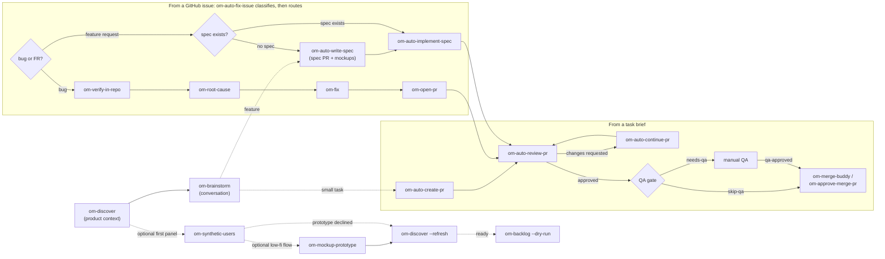

<p align="center">
  <a href="https://github.com/open-mercato/open-mercato">
    
  </a>
</p>

<h1 align="center">Open Mercato Skills</h1>

<p align="center">
  <b>🧠 plan · 🔨 implement · 🔍 review · ✅ QA gate · 🚢 merge</b><br/>
  Forty-one agent skills that run a full PR pipeline. Install them into any repo, with any coding agent.
</p>

<p align="center">
  <a href="LICENSE"></a>
  <a href="https://skills.sh"></a>
  <a href="https://github.com/open-mercato/skills/pulls"></a>
</p>

<!-- PIOTR: rewrite in your voice -->
These skills wrote and shipped a real product. Inside the [Open Mercato](https://github.com/open-mercato/open-mercato) project, this workflow produced ~800k lines of code with zero hand-written lines, 1700+ merged PRs, 4000 unit tests, 730 integration tests, and weekly releases, with 100+ contributors working through it. This repository extracts the pipeline itself, stripped of everything product-specific, so any team with a GitHub repo can run it.

## ⚡ 30-second quickstart

```bash
npx skills add open-mercato/skills --skill '*'
```

Install all forty-one — the pipeline composes, and every skill is small until invoked. Drop `--skill '*'` to cherry-pick interactively. Skills install for 22+ coding agents (Claude Code, Cursor, Codex, and others) via [skills.sh](https://skills.sh).

Then, once per repository:

```
/om-setup-agent-pipeline
```

It inspects your repo (default branch, validation scripts, GitHub labels), asks a few questions, writes `.ai/agentic.config.json`, and generates `SDLC.md` — your team's ticket-flow doc. Every other skill reads the config.

Then ship something:

```
/om-auto-create-pr "add rate limiting to the login endpoint"
```

The agent drafts an execution plan, implements it phase by phase in an isolated worktree, runs your validation commands, reviews its own diff, and opens a labeled, reviewed PR.

## 🔄 Update an existing installation

Update project-installed skills from the project directory:

```bash
npx skills update -p
```

For skills installed globally, update the global installation instead:

```bash
npx skills update -g
```

This refreshes the installed skill files to their latest versions. It does not overwrite artifacts that the setup skill previously generated inside your repository, including `.ai/trackers/<tracker>.md` and `.ai/browsers/<provider>.md`. After updating, run:

```text
/om-apply-upgrade-notes
```

That skill applies the relevant [UPGRADE_NOTES.md](UPGRADE_NOTES.md) migrations while preserving local edits.

ℹ️ A few skills drive a real browser through the configured browser provider — [`om-prepare-test-env`](docs/skills/om-prepare-test-env.md), [`om-integration-tests`](docs/skills/om-integration-tests.md), and [`om-auto-qa-pr`](docs/skills/om-auto-qa-pr.md). Because of that, skills.sh validation may flag them as **Medium** or **High** risk. We of course recommend reading any skill before you run it — but we use these exactly as shipped at Open Mercato, with no issues so far.

## 🎬 See how it works!

[](https://www.youtube.com/watch?v=zPNW-xtwNsE)

## 🛠️ Local development

Working on the skills themselves? Skip the `npx skills add` round-trip and symlink this checkout straight into your agents' skill directories:

```bash
npm run install-skills
```

This links every skill in `skills/` into `~/.claude/skills` (Claude Code) and `~/.codex/skills` (Codex). Because they are symlinks, any edit you make in this repo is live on the next skill invocation — no reinstall needed.

Options:

```bash
npm run install-skills -- --agent claude   # only one agent (claude or codex)
npm run install-skills -- --force          # replace existing non-symlink installs
npm run uninstall-skills                   # remove only the links owned by this repo
```

The installer never touches skills it does not own: an existing real directory (e.g. installed earlier via `npx skills add`) is skipped with a warning unless you pass `--force`, and uninstall removes only symlinks that point into this checkout.

## 🔁 The pipeline

Three entry paths: hand the agent a task brief ([`om-auto-create-pr`](docs/skills/om-auto-create-pr.md)), a spec ([`om-auto-write-spec`](docs/skills/om-auto-write-spec.md) to author one, [`om-auto-implement-spec`](docs/skills/om-auto-implement-spec.md) to build one), or a GitHub issue ([`om-auto-fix-issue`](docs/skills/om-auto-fix-issue.md)). The issue path classifies first — a bug drives the autofix chain, a feature request gets its spec resolved (or autonomously written) and implemented on the same PR. All paths converge on the same review loop and the same QA gate. And when there is no artifact yet — just an idea or a question — [`om-brainstorm`](docs/skills/om-brainstorm.md) runs the conversation first and hands the pipeline a routing decision plus a brief. Before even that, [`om-discover`](docs/skills/om-discover.md) establishes the product context every later decision reads: a `product-brief.md` built from real material — interviews, data, documents — with every claim tagged by its evidence and every decision owned by a person.

The skills chain: every PR-producing skill ends with a `PR: #<number> (link: <url>)` reference line the next skill consumes, and every skill checks for a PR a previous skill already opened and continues on it instead of opening a duplicate. A completed autonomous run always leaves a **ready, fully labeled PR** (pipeline + category + priority + risk + QA meta) with a run-summary comment — and screenshots from the working app when the change is user-facing. Skills claim PRs and issues with an `in-progress` label, so concurrent agents back off instead of colliding.



## 📦 Skill catalog

📇 Per-skill cards with parameters: [docs/skills/](docs/skills/README.md)

### 🤖 Autonomous skills

**Naming convention:** the `om-auto-*` prefix means **autonomous and non-interactive** — hand these a brief, an issue, or nothing at all and they run end-to-end without supervision: they claim their work with the `in-progress` lock so concurrent agents back off, work in isolated worktrees so your checkout stays untouched, run the validation gate, self-review, make the recommended most-reversible call themselves (documented for override) instead of stopping to ask, and finish with a PR, a review verdict, or a reconciled tracker. Safe to run on a schedule or in CI. Every skill **without** the `auto` prefix is interactive: it acts once, may ask you questions, reports, and hands control back.

| Skill | What it does autonomously |
|---|---|
| [`om-auto-create-pr`](docs/skills/om-auto-create-pr.md) | Takes a free-form task brief end-to-end: execution plan, isolated worktree, phase-by-phase commits, validation gate, self-review, labeled PR, then an autofix review loop until clean. Resumable. Hands runs whose plan exceeds the configured step threshold to [`om-auto-create-pr-loop`](docs/skills/om-auto-create-pr-loop.md) automatically. |
| [`om-auto-create-pr-loop`](docs/skills/om-auto-create-pr-loop.md) | Advanced om-auto-create-pr for long spec implementations: run folder with PLAN/HANDOFF/NOTIFY, one commit per step, checkpoint verification every ~5 steps, plan-driven executor dispatch (per-step placement + model-tier hints in the plan), full gate at completion. |
| [`om-auto-fix-issue`](docs/skills/om-auto-fix-issue.md) | The single issue-to-PR entry point: classifies the issue first, then routes. A bug drives the autofix chain — triage gate, root-cause analysis, minimal fix with regression tests, a ready labeled PR, autofix review loop. A feature request takes the feature route — claims the issue, resolves its spec (autonomously written via [`om-auto-write-spec`](docs/skills/om-auto-write-spec.md) when none exists, implemented via [`om-auto-implement-spec`](docs/skills/om-auto-implement-spec.md)), and verifies the contract on the same PR — reviewed, UI-verified, fully labeled. For a spec without implementation, run `om-auto-write-spec` directly. Stops cleanly when the issue is already solved or claimed, and on the feature route when the ticket fails `SDLC.md`'s Definition of Ready (the gaps are named on the issue). |
| [`om-auto-write-spec`](docs/skills/om-auto-write-spec.md) | Turns a brief or FR issue into a finished spec on a ready PR: autonomous Open-Questions defaults posted for override, UI mockups + current-app screenshots attached as PR evidence, full SDLC labels, chain markers for [`om-auto-implement-spec`](docs/skills/om-auto-implement-spec.md). |
| [`om-auto-implement-spec`](docs/skills/om-auto-implement-spec.md) | Implements an existing spec (by path, name, issue, or spec-PR number; clean stop when not found): reuses the spec PR's branch or runs [`om-auto-create-pr`](docs/skills/om-auto-create-pr.md), then the review autofix loop and UI verification with screenshots on the PR. |
| [`om-auto-continue-pr`](docs/skills/om-auto-continue-pr.md) | Resumes an in-progress PR from the first unchecked step in its tracking plan and carries it to completion — implementation, validation, review loop, summary comment. A PR with no plan (a human's, another tool's, a crashed run's) is adopted: the goal is reconstructed from its description, comments, review feedback, linked issues and diff, landed as a real plan, then executed. |
| [`om-auto-continue-pr-loop`](docs/skills/om-auto-continue-pr-loop.md) | Resumes runs started by [`om-auto-create-pr-loop`](docs/skills/om-auto-create-pr-loop.md): orients from HANDOFF.md, picks up at the first non-done Tasks-table row, keeps the per-step commit and checkpoint discipline to completion. |
| [`om-auto-review-pr`](docs/skills/om-auto-review-pr.md) | Reviews a PR by number in an isolated worktree, approves or requests changes, manages labels. On changes-requested, its autofix loop iterates fixes and re-review until merge-ready. A spec-only design PR gets a **specification review** instead of the code checklist: what can go wrong, backward compatibility, what's missing, how the spec can be improved, and whether it is the simplest possible solution — same severity scale and verdict rule, and the autofix loop amends the spec document (never adds implementation). |
| [`om-auto-fix-pr`](docs/skills/om-auto-fix-pr.md) | Drives one PR to merge-ready: merges the latest base in first, then loops review-autofix ([`om-auto-review-pr`](docs/skills/om-auto-review-pr.md)), its own CI-stabilization step (classify each failing check as real bug / test bug / flake / infra, fix the real ones with tests, never fake green), and UI QA ([`om-auto-qa-pr`](docs/skills/om-auto-qa-pr.md)), re-merging base whenever it advances. Files follow-up issues for non-blocking nits via [`om-followup-issue-from-pr`](docs/skills/om-followup-issue-from-pr.md), keeps the fork carry-forward supersede/credit rules, normalizes labels, and hands off to [`om-approve-merge-pr`](docs/skills/om-approve-merge-pr.md) — it never merges itself. A `--ci-only [--branch <name>]` mode drives a plain branch or no-PR change to green CI without the rest of the loop. |
| [`om-pr-autopilot`](docs/skills/om-pr-autopilot.md) | The single "just finish this PR" entry point: diagnoses what state one open PR is actually in — unfinished plan steps, missing review, unresolved conversations, red CI, base conflicts, missing labels or QA evidence, merge-ready — then maps that onto an ordered chain of the skills above and runs it, re-diagnosing between steps. Dispatch only: [`om-auto-continue-pr`](docs/skills/om-auto-continue-pr.md), [`om-auto-fix-pr`](docs/skills/om-auto-fix-pr.md), [`om-auto-qa-pr`](docs/skills/om-auto-qa-pr.md), [`om-followup-issue-from-pr`](docs/skills/om-followup-issue-from-pr.md) and [`om-approve-merge-pr`](docs/skills/om-approve-merge-pr.md) do the work. Never merges without `--allow-merge`; `--dry-run` diagnoses and mutates nothing. |
| [`om-review-prs`](docs/skills/om-review-prs.md) | Sweeps all unreviewed open PRs, newest first, through [`om-auto-review-pr`](docs/skills/om-auto-review-pr.md), respecting claim locks. |
| [`om-close-fixed-issues`](docs/skills/om-close-fixed-issues.md) | Post-merge housekeeping sweep: closes issues that merged PRs fix, comments on issues whose PRs were closed without merging. |

### 🧑‍💻 Interactive skills

Interactive helpers (no `auto` in the name — the other half of the naming convention): they act once, may ask you questions along the way, report, and hand control back to you.

| Skill | What it does |
|---|---|
| [`om-setup-agent-pipeline`](docs/skills/om-setup-agent-pipeline.md) | One-per-repo configurator. Inspects the repository, asks a few questions, writes `.ai/agentic.config.json`, installs tracker and browser-provider descriptors, generates `SDLC.md` and an `AGENTS.md` starter when missing. Verifies cross-skill coverage: if an installed skill references one that isn't installed, it prints the exact `npx skills add` command to fix it. |
| [`om-setup-discovery-pipeline`](docs/skills/om-setup-discovery-pipeline.md) | Adds the optional product layer to a configured repo: one yes per product role, a `discovery` block in the config, and the Discovery stage, Definition of Ready, product roles, and protected product decisions inserted into the existing `SDLC.md` between markers. Turns on the readiness checks in [`om-auto-manage-issues`](docs/skills/om-auto-manage-issues.md), [`om-auto-fix-issue`](docs/skills/om-auto-fix-issue.md), and [`om-backlog`](docs/skills/om-backlog.md); nothing in [`om-discover`](docs/skills/om-discover.md) requires it. |
| [`om-apply-upgrade-notes`](docs/skills/om-apply-upgrade-notes.md) | Post-upgrade migrator. Applies `UPGRADE_NOTES.md` to the repo: re-syncs installed tracker/browser descriptors while preserving local edits, reports custom-provider gaps, and checks the config against notable upgrades. |
| [`om-merge-buddy`](docs/skills/om-merge-buddy.md) | Scans open PRs and reports which can merge now and which are close but blocked, based on labels, reviews, CI, and mergeability. |
| [`om-pipeline-retro`](docs/skills/om-pipeline-retro.md) | Classifies runs the pipeline already finished — clean single pass, hard recovery, loop checkpoints, or a second pass with no recorded cause — and ranks the causes by the wall-clock hours they cost. Read-only; hands the top cause to `om-prepare-issue`. |
| [`om-approve-merge-pr`](docs/skills/om-approve-merge-pr.md) | Approves and squash-merges a PR given only its number. Can file a follow-up issue at the same time. |
| [`om-check-and-commit`](docs/skills/om-check-and-commit.md) | Runs the configured validation gate on the current branch, fixes obvious drift, then commits and pushes when green. |
| [`om-followup-issue-from-pr`](docs/skills/om-followup-issue-from-pr.md) | Turns a PR or a PR comment into a tracked follow-up issue, assigned to the right person. |
| [`om-discover`](docs/skills/om-discover.md) | Product-level discovery and define, before there is anything to brainstorm about. Runs in three modes — existing product, client idea, own idea — and leaves one `product-brief.md`: problem and who has it, stakeholders, rules, flows, benchmark, success criteria, scope (now, later, not doing), non-goals, decisions with owners, riskiest assumptions with tests, open questions. Gathers real material first: a section with nothing behind it becomes a collection plan with capture templates, never prose; synthetic personas and assumptions are tagged and never count as evidence. [`om-brainstorm`](docs/skills/om-brainstorm.md), [`om-spec-writing`](docs/skills/om-spec-writing.md), and [`om-prepare-issue`](docs/skills/om-prepare-issue.md) read the brief when it exists, and its non-goals, business rules, and decisions become a contract the review skills enforce. |
| [`om-synthetic-users`](docs/skills/om-synthetic-users.md) | A panel of personas from the material the repo already holds, interviewed about the last time and then under the pressures the brief describes (never "would you use"), walking one flow through their eyes — on the brief or spec as a narrative, on a static prototype, or on the running app through the browser provider. Fresh panel per run, at least two runs, only what repeats is a finding, spread is the error bar; saturation tracked; a parity check against real interview notes when they exist, where the deviation is the finding. Three stances: `validate`, `simulate` (every answer is "to confirm"), `adversary` (agreement is discarded). Everything tagged `[SYNTHETIC]`, never evidence, never numbers. |
| [`om-mockup-prototype`](docs/skills/om-mockup-prototype.md) | Turns a selected brief flow and the first synthetic panel into a neutral clickable discovery prototype. Keeps assumptions visible, checks navigation and recovery states in a browser, and writes a local revision with its context. It runs before the brief refresh and backlog; detailed visual design belongs to the later specification stage. |
| [`om-backlog`](docs/skills/om-backlog.md) | Turns a product brief or a spec's Phasing into epics, stories with acceptance criteria, and tasks — ids in titles, `Epic:` lines, epic checklists — filing every issue through [`om-prepare-issue`](docs/skills/om-prepare-issue.md) so dedupe, labels, and rationale are unchanged. Adopts existing issues instead of duplicating them, refuses a brief that rests on assumptions (offering the research backlog instead), and shows the whole tree before writing anything. |
| [`om-brainstorm`](docs/skills/om-brainstorm.md) | The conversation before any artifact exists: open questions one at a time, alternatives weighed (including building nothing), a challenger subagent attacks the conclusion, then the user confirms a routing decision — a machine-parsed `Next:` line plus a handoff brief that feeds [`om-prepare-issue`](docs/skills/om-prepare-issue.md), [`om-auto-write-spec`](docs/skills/om-auto-write-spec.md), [`om-spec-writing`](docs/skills/om-spec-writing.md), or [`om-auto-create-pr`](docs/skills/om-auto-create-pr.md). |
| [`om-spec-writing`](docs/skills/om-spec-writing.md) | Writes and reviews feature specs to staff-engineer standards: skeleton-first with a hard Open Questions gate, phased implementation breakdown that feeds [`om-auto-create-pr`](docs/skills/om-auto-create-pr.md), severity-ranked architectural reviews. |
| [`om-prepare-issue`](docs/skills/om-prepare-issue.md) | Files a single well-formed tracker issue for deferred work: dedupes against existing issues and PRs, links (or authors) a covering spec, otherwise embeds step-by-step guidance, and applies the SDLC labels on creation. |
| [`om-auto-manage-issues`](docs/skills/om-auto-manage-issues.md) | Brings existing issues up to standard, single or in bulk: applies missing SDLC labels, and for a laconic issue (one line + a screenshot) analyzes the screenshot with the terse text, clarifies the wording non-destructively, and posts the agent's understanding as a comment. Checks every issue against the Definition of Ready in `SDLC.md` and posts a not-ready comment naming what is missing. Checks spec coverage for feature issues: when one lacks a covering spec it posts a spec-required comment to the issue author (fill up the spec before implementation), or authors the spec itself via [`om-auto-write-spec`](docs/skills/om-auto-write-spec.md) with `--write-missing-specs` (default off). Batch defaults to the last ~25 open, worst-described first, narrowable by state/label/author/limit. Idempotent and claim-aware. |
| [`om-integration-tests`](docs/skills/om-integration-tests.md) | Creates and runs integration/E2E tests by exploring the running app first — real locators, runtime fixtures, no hardcoded IDs — and reports failures with artifact-based per-test diagnosis. Reuses the shared [`om-prepare-test-env`](docs/skills/om-prepare-test-env.md) instance so QA and tests hit the same booted app. |
| [`om-auto-qa-pr`](docs/skills/om-auto-qa-pr.md) | QAs a change's UI in a real browser without merging. Checks the PR's review state first and runs [`om-auto-review-pr`](docs/skills/om-auto-review-pr.md) when the PR is still unreviewed, then boots the app via [`om-prepare-test-env`](docs/skills/om-prepare-test-env.md), derives a scenario from the diff, drives the configured browser provider with screenshots, and produces a pass/fail report. Posts evidence as a PR comment when a tracker is configured; otherwise saves screenshots + JSON/Markdown reports. |
| [`om-auto-update-changelog`](docs/skills/om-auto-update-changelog.md) | Drafts a CHANGELOG.md release entry for every PR merged since the last release — emoji categories, contributor credits resolved by the Supersede Credit Rule and verified against commit authorship so carry-forwards and umbrella merges credit the author, not the merger — then delegates to [`om-auto-create-pr`](docs/skills/om-auto-create-pr.md) to ship it as a docs PR. |

### 🤝 Skills invoke each other

The building blocks behind the autofix chain and the review loop. You can call them directly, but they mainly exist for the other skills to compose.

| Skill | What it does |
|---|---|
| [`om-verify-in-repo`](docs/skills/om-verify-in-repo.md) | Read-only triage gate: decides whether a GitHub issue is a real, still-unfixed defect, and stops the chain cleanly when there is nothing to do. |
| [`om-root-cause`](docs/skills/om-root-cause.md) | Read-only analysis: locates the bug and the minimal change surface so the fix step never re-explores the repo. |
| [`om-fix`](docs/skills/om-fix.md) | Implements the minimal change, adds regression tests, runs the validation gate. Does not commit or push. |
| [`om-open-pr`](docs/skills/om-open-pr.md) | The shared PR opener: commits, pushes, opens (or reuses) a ready PR with the unified body template, applies the full SDLC label set, posts the run summary, releases the claim lock, and emits the chain markers. |
| [`om-code-review`](docs/skills/om-code-review.md) | The review checklist behind [`om-auto-review-pr`](docs/skills/om-auto-review-pr.md): correctness, security, contract surfaces, plus your repo-local checklist when configured. |
| [`om-prepare-test-env`](docs/skills/om-prepare-test-env.md) | Boots the app for QA and tests, any stack: reuses the repo's own environment or generates portable bring-up scripts, then caches builds and validates warm reuse. It autonomously provisions the configured browser provider (agent-browser by default; Playwright supported), writes a shared environment descriptor, and works on macOS, Linux, WSL2, and Windows. |

## 👥 Workflows by role

Same pipeline, different entry points. Each role runs one or two commands; the skills chain the rest automatically. Deeper guides live under [docs/roles/](docs/roles/).

### 📋 Product Manager / Analyst

Turn ideas into well-formed, labeled work — and review the plan before any code is written.

| ▶️ You run | ⚙️ Runs automatically inside | 🎁 You get |
|---|---|---|
| `/om-setup-discovery-pipeline` once | [`om-setup-agent-pipeline`](docs/skills/om-setup-agent-pipeline.md) when the delivery layer is missing; the SDLC template's product-layer blocks | the product layer switched on: product roles, the Discovery stage, the Definition of Ready, and protected decisions in `SDLC.md`, and the readiness gate the skills below enforce |
| `/om-discover --mode client "Benefits portal for SMB clients"` | context gate over your research folder, interview rounds, a skeptic subagent, a quality gate against invented evidence | `product-brief.md` with tagged evidence and owned decisions, or a collection plan naming what still has to be gathered |
| `/om-synthetic-users .ai/specs/product-brief.md --flow "first claim"` | personas built from the brief's evidence, simulated interviews, a narrative or browser walk, a quality gate against invented detail | barriers, missing cases, and contradictions as `[SYNTHETIC]` hypotheses, each with the real-user check that would settle it |
| `/om-backlog .ai/specs/product-brief.md` | readiness check against the Definition of Ready, dedupe per story, [`om-prepare-issue`](docs/skills/om-prepare-issue.md) per issue | epics, stories with acceptance criteria, and tasks in the tracker, ids in titles, a `backlog.md` map — after you have seen the tree and said yes |
| `/om-brainstorm "should we build bulk-archive?"` | read-only repo reading and tracker checks, a challenger subagent | a routing decision with its reasoning, and a brief file the pipeline can run with |
| `/om-prepare-issue "Bulk-archive orders from the grid"` | dedupe search, [`om-spec-writing`](docs/skills/om-spec-writing.md) (when a feature needs a spec) | one well-formed issue with SDLC labels, a linked spec or step-by-step guidance |
| `/om-auto-manage-issues` | claim-aware label sync, screenshot analysis, implementation-prep comment, spec-coverage check | the backlog triaged: missing labels added, laconic issues clarified, feature issues without a spec get a spec-required comment to their author (or a spec via `--write-missing-specs`) |
| `/om-auto-write-spec 123` | `om-spec-writing --autonomous`, [`om-open-pr`](docs/skills/om-open-pr.md) | a spec-first PR to review before implementation starts |

More: [docs/roles/product-manager.md](docs/roles/product-manager.md)

### 🎨 Designer

Get a written spec with visuals attached — mockups of the new layout next to screenshots of the current app.

| ▶️ You run | ⚙️ Runs automatically inside | 🎁 You get |
|---|---|---|
| `/om-auto-write-spec "Redesign the checkout summary panel"` | `om-spec-writing --autonomous`, [`om-open-pr`](docs/skills/om-open-pr.md), [`om-prepare-test-env`](docs/skills/om-prepare-test-env.md) + browser provider | a ready spec PR with UI mockups, current-app screenshots, and an assumptions comment |
| `/om-auto-implement-spec 2026-07-18-checkout-redesign` | [`om-auto-create-pr`](docs/skills/om-auto-create-pr.md), [`om-auto-review-pr`](docs/skills/om-auto-review-pr.md), [`om-auto-qa-pr`](docs/skills/om-auto-qa-pr.md) | the built change with before/after screenshots from the working app |
| `/om-auto-qa-pr 123` | [`om-prepare-test-env`](docs/skills/om-prepare-test-env.md), browser provider | fresh screenshots of a PR's UI to design-review, no source touched |
| `/om-ux-setup` once, then `/om-ux-review-pr 123` | [`om-ux-setup`](docs/skills/om-ux-setup.md) extracts the repo's design contract; [`om-ux-review-pr`](docs/skills/om-ux-review-pr.md) walks the PR in a real browser | a design review judged against your own design system: evidence-tagged findings with done-when criteria |
| `/om-ux-shape "Quick-add flow for the people list"` | [`om-ux-shape`](docs/skills/om-ux-shape.md) | a decided direction before anything is drawn: scope, states, riskiest-assumption test |

💡 Tip — ask for visuals explicitly to force mockups: `/om-auto-write-spec "Redesign the checkout summary panel — include mockups of the new layout and screenshots of the current one"`.

More: [docs/roles/designer.md](docs/roles/designer.md)

### 👩‍💻 Developer

Hand off a brief, a spec, or an issue number; get back a reviewed, labeled PR.

| ▶️ You run | ⚙️ Runs automatically inside | 🎁 You get |
|---|---|---|
| `/om-auto-write-spec "CSV export for the orders grid"` | `om-spec-writing --autonomous`, [`om-open-pr`](docs/skills/om-open-pr.md), browser provider for mockups | a ready spec PR with mockups + assumptions comment |
| `/om-auto-implement-spec 2026-07-18-csv-export` | [`om-auto-create-pr`](docs/skills/om-auto-create-pr.md) / [`om-auto-continue-pr`](docs/skills/om-auto-continue-pr.md), [`om-auto-review-pr`](docs/skills/om-auto-review-pr.md), [`om-auto-qa-pr`](docs/skills/om-auto-qa-pr.md) | an implemented, reviewed PR with screenshots from the working app |
| `/om-auto-fix-issue 123` | classifies then routes: bugs to the autofix chain, features to [`om-auto-write-spec`](docs/skills/om-auto-write-spec.md) + [`om-auto-implement-spec`](docs/skills/om-auto-implement-spec.md) | a finished, fully-labeled PR from an issue number |
| `/om-auto-fix-issue 456` | [`om-verify-in-repo`](docs/skills/om-verify-in-repo.md), [`om-root-cause`](docs/skills/om-root-cause.md), [`om-fix`](docs/skills/om-fix.md), [`om-open-pr`](docs/skills/om-open-pr.md), [`om-auto-review-pr`](docs/skills/om-auto-review-pr.md) | a bug-fix PR with regression tests and a clean review |
| 🔁 `/om-auto-create-pr-loop "Implement the multi-tenant billing spec"` | run folder (PLAN/HANDOFF/NOTIFY), per-step commits, checkpoint verification | a resumable, step-tracked PR for a large spec (continue with [`om-auto-continue-pr-loop`](docs/skills/om-auto-continue-pr-loop.md); plain runs escalate here on their own past the step threshold) |

More: [docs/roles/developer.md](docs/roles/developer.md)

### 🧪 QA

Boot the app once, verify UI changes in a real browser, and add integration coverage — without touching source.

| ▶️ You run | ⚙️ Runs automatically inside | 🎁 You get |
|---|---|---|
| `/om-prepare-test-env` | app discovery, launch-script generation, browser-provider provisioning | a reusable booted app + shared test-env descriptor the other QA skills reuse |
| `/om-auto-qa-pr 123` | [`om-prepare-test-env`](docs/skills/om-prepare-test-env.md), browser provider | screenshots + a pass/fail report posted on the PR (evidence only, no labels changed) |
| `/om-auto-qa-pr 123 --self-qa-signoff` | same, plus label guards | `qa-approved` + `qa-self-verified` — only on a fully-green run with screenshots on a `needs-qa` PR |
| `/om-integration-tests` | [`om-prepare-test-env`](docs/skills/om-prepare-test-env.md), browser provider | integration/E2E tests written against the live app, with artifact-based failure diagnosis |

More: [docs/roles/qa.md](docs/roles/qa.md)

### 🚀 Release Manager

Sweep open PRs, drive them to merge-ready, and ship — the QA gate stays a human decision.

| ▶️ You run | ⚙️ Runs automatically inside | 🎁 You get |
|---|---|---|
| `/om-merge-buddy` | tracker scan of labels, reviews, CI, mergeability | a report of which PRs can merge now and which are close but blocked |
| `/om-review-prs` | [`om-auto-review-pr`](docs/skills/om-auto-review-pr.md) per PR, claim-lock aware | every unreviewed open PR reviewed, newest first |
| `/om-auto-fix-pr 123` | [`om-auto-review-pr`](docs/skills/om-auto-review-pr.md), its CI-stabilization step, [`om-auto-qa-pr`](docs/skills/om-auto-qa-pr.md), [`om-followup-issue-from-pr`](docs/skills/om-followup-issue-from-pr.md) | one PR driven to approvable, green, QA-evidenced — handed to [`om-approve-merge-pr`](docs/skills/om-approve-merge-pr.md), never self-merged |
| `/om-auto-fix-pr 123 --ci-only` | tracker check status + failed-step logs | green CI from real fixes with tests, never by weakening checks |
| `/om-pr-autopilot 123` | diagnosis of the PR's real state, then the matching chain of the skills above | one PR driven from wherever it is to merge-ready, with a summary comment covering every step — never merged unless `--allow-merge` |
| `/om-auto-update-changelog` | [`om-auto-create-pr`](docs/skills/om-auto-create-pr.md) | a CHANGELOG release entry landed as a docs PR, with Supersede Credit |
| `/om-approve-merge-pr 123` | approving review + squash-merge, QA-gate guard | the PR merged — refused when `needs-qa` lacks `qa-approved` or a blocking label is set |

More: [docs/roles/release-manager.md](docs/roles/release-manager.md)

## 🧰 Works with any stack

Nothing here assumes JavaScript, or any particular product. The base branch, the validation commands, the label taxonomy, and the working paths all come from one committed file, `.ai/agentic.config.json`, written by [`om-setup-agent-pipeline`](docs/skills/om-setup-agent-pipeline.md):

```json
{
  "version": 1,
  "baseBranch": "auto",
  "tracker": "github",
  "browser": { "provider": "agent-browser" },
  "validation": {
    "commands": ["pnpm typecheck", "pnpm test", "pnpm build"]
  },
  "labels": {
    "enabled": true,
    "pipeline": ["review", "changes-requested", "qa", "qa-failed", "merge-queue", "blocked", "do-not-merge"],
    "category": ["bug", "feature", "refactor", "security", "dependencies", "documentation"],
    "meta": ["needs-qa", "skip-qa", "qa-approved", "qa-self-verified", "in-progress"],
    "priority": ["priority-low", "priority-medium", "priority-high", "priority-extreme"],
    "risk": ["risk-low", "risk-medium", "risk-high"]
  },
  "qaGate": true,
  "paths": {
    "runs": ".ai/runs",
    "analysis": ".ai/analysis",
    "specs": ".ai/specs",
    "scripts": ".ai/scripts",
    "qa": ".ai/qa"
  },
  "reviewChecklist": null,
  "closeKeywords": []
}
```

A Rust repo puts `cargo test` and `cargo clippy` in `validation.commands`; a Go repo puts `go test ./...`. Skills run whatever you configure and treat any non-zero exit as a gate failure. A skill invoked in a repo without the config runs [`om-setup-agent-pipeline`](docs/skills/om-setup-agent-pipeline.md) first — interactively when you're there to answer its questions, with `--defaults` when running unattended — then continues with the freshly written config.

GitHub is the default tracker; a repository whose `origin` is on GitLab (gitlab.com or self-managed) defaults to the stand-alone GitLab provider, which runs issues, merge requests, reviews, CI pipelines, and labels through `glab`. Shipped split-provider templates also support Linear issues through `schpet/linear-cli` and Jira Cloud work items through Atlassian CLI, while GitHub continues to own PRs, reviews, and CI — see the tracker providers section below.

Agent-browser is the default browser automation provider for fresh setups. It
installs itself and Chrome for Testing when needed; existing repositories remain
on Playwright until their config makes a provider explicit.

## 🎨 Make it yours

Four layers of project fit, no forking:

- **Agent instructions** — skills read your `AGENTS.md` / `CLAUDE.md` before working, so project conventions apply from the first run. No such file? [`om-setup-agent-pipeline`](docs/skills/om-setup-agent-pipeline.md) offers a starter.
- **Generated project docs** — `SDLC.md` (the process doc), `CODE_REVIEW.md` (review rules, auto-applied by [`om-code-review`](docs/skills/om-code-review.md)), `BACKWARD_COMPATIBILITY.md` (protected contract surfaces — reviews flag violations, implementations warn you), and an `AGENTS.md` starter with a task-routing table. [`om-setup-agent-pipeline`](docs/skills/om-setup-agent-pipeline.md) derives each from your repository and only when the file is missing; existing docs are honored as-is.
- **Repo-local skills** — drop a skill with the same name into your repo at `.ai/skills/<skill-name>/SKILL.md` and it takes precedence over the installed one (details below).
- **Tracker descriptor** — every issue/PR/label command the skills run lives in one committed file, `.ai/trackers/<tracker>.md`, that you can edit or replace (details below).

## 🧩 Extending the skills

### How a skill is laid out

Each skill keeps its numbered main algorithm in `SKILL.md` and factors its repeatable procedures into per-skill `references/<step>.md` files under standard names — `agentic-setup.md`, `worktree-setup.md`, `claim-pr.md`, `pr-finalize.md`, `review-report.md`, `rules.md`. These standard step files are deliberately **duplicated inside every skill that uses them** rather than shared through cross-skill pointers, so each skill installs and runs standalone ([`om-auto-create-pr`](docs/skills/om-auto-create-pr.md) holds the canonical copy). The trade-off is intentional: standalone installability over DRY. When you edit a standard step file in one skill, sync the same change into the other skills that carry it — the collection's own contributor rule is to ask whether to propagate before doing so.

### Repo-local skill overrides

Every installed skill checks, right after loading the config, for a repo-local skill of the same name at `.ai/skills/<skill-name>/SKILL.md`. When present, the local skill wins — the installed one follows it instead of its own instructions. To *extend* rather than replace, the local skill just `@`-imports or references the installed skill and adds rules on top:

```markdown
<!-- .ai/skills/om-auto-review-pr/SKILL.md -->
Follow the installed `om-auto-review-pr` skill, plus:

- Also run `pnpm test:e2e` before approving PRs that touch `apps/web`.
- Our PR body template additionally requires a "Screenshots" section for UI changes.
```

Local rules win, but a local skill can never relax the installed skill's safety rules (no skipping tests, no `--no-verify`, no force-pushes). This convention is also what makes the collection a drop-in for repos that already keep specialized `om-*` skills under `.ai/skills/`: the installed skills defer to them automatically.

### Project management (tracker) providers

No skill calls `gh` — or any tracker CLI — directly. Skills name **tracker operations** (**get-issue**, **create-pr**, **comment-pr**, **merge-pr**, …) and one committed descriptor file, `.ai/trackers/<tracker>.md`, defines how each operation is executed. [`om-setup-agent-pipeline`](docs/skills/om-setup-agent-pipeline.md) asks which tracker you use, sets the config's `tracker` field, and installs the matching descriptor into your repo.

That file is yours, which makes three things easy:

- **Extend or override GitHub behavior** — edit `.ai/trackers/github.md`: add flags, change the merge strategy, adjust comment conventions, extend the label taxonomy commands. Every skill picks it up on its next run.
- **Run on GitLab** — select `gitlab` to run the whole pipeline on gitlab.com or a self-managed instance through [`glab`](https://gitlab.com/gitlab-org/cli). A merge request is the "PR" every skill talks about; the descriptor serializes it into the same fields skills already parse, records review verdicts as native approvals plus marker notes, and reads CI from the MR's head pipeline. No companion descriptor is needed.
- **Use a shipped split provider** — select `linear` for Linear issues through [`schpet/linear-cli`](https://github.com/schpet/linear-cli), or `jira` for Jira Cloud work items through [Atlassian CLI](https://developer.atlassian.com/cloud/acli/guides/introduction/). Setup installs the selected descriptor plus `github.md`, because the code host still owns PRs, reviews, CI, and PR labels. The templates document authentication, issue-label semantics, claim signals, identifier cross-links, and explicit post-merge issue transitions.
- **Bring your own tracker** — write `.ai/trackers/<name>.md` from the shipped `TEMPLATE.md` (in `om-setup-agent-pipeline/references/trackers/`), implementing each operation with your tracker's CLI, MCP tools, or API, and set `"tracker": "<name>"` in the config. No skill changes needed — the descriptor is the whole integration surface.
- **Build another split setup** — implement issue operations against the project tracker and delegate repository/PR/review/CI/PR-label operations to its code-host companion. The template documents the pattern, including how identifiers cross-link (for example, an `ENG-123` ticket referenced from a GitHub PR).

The claim protocol (assignee + `in-progress` + 🤖 comment), the label guards (missing label ⇒ logged skip, `labels.enabled: false` ⇒ no label ops), and the QA gate semantics are part of the contract — a provider must express them, in whatever way its tracker allows.

### Browser automation providers

QA and integration-test skills select `browser.provider` from
`.ai/agentic.config.json` and execute the committed descriptor at
`.ai/browsers/<provider>.md`. Fresh setups use agent-browser; Playwright remains
available for existing repositories and teams that prefer it. The agent-browser
descriptor downloads its native release binary and Chrome for Testing itself,
then verifies a live headless launch — no Node runtime, project dependency, or
cloud-browser subscription is required.

Custom providers implement the operations in
`skills/om-setup-agent-pipeline/references/browsers/TEMPLATE.md`. Repository E2E
suites remain authoritative; the provider controls agent-driven exploration,
assertions, and screenshots.

## 🏷️ Labels and the QA gate

Every PR carries at most one pipeline label (`review`, `changes-requested`, `merge-queue`, ...) plus additive category, meta, priority, and risk labels; priority says how urgent the work is, risk says how dangerous the change is to ship. The full taxonomy, and whether to use labels at all, lives in the config; [`om-setup-agent-pipeline`](docs/skills/om-setup-agent-pipeline.md) documents every group and creates missing labels for you.

A PR labeled `needs-qa` cannot merge without `qa-approved`, even with green checks. A QA reviewer grants approval, or `om-auto-qa-pr --self-qa-signoff` uses the documented exception below `risk-high`, with evidence tied to the current head and the `qa-self-verified` label. Authoring and merge skills do not grant QA approval.

## 🚀 Built with this workflow

<!-- PROOF: case studies land here before launch -->

Real production case studies are being added here.

---

<!-- PIOTR: rewrite in your voice -->
Built by the [Open Mercato](https://github.com/open-mercato/open-mercato) team, where these skills ship the product every week. We teach this way of working at [aitechleaders.pl](https://aitechleaders.pl) (an AI engineering course, in Polish).
